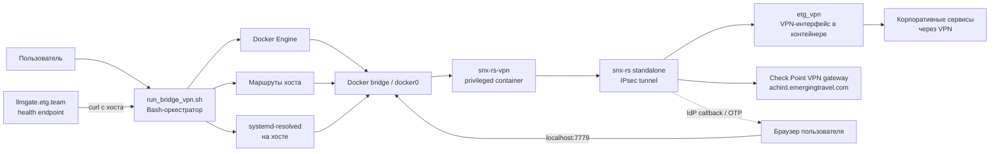
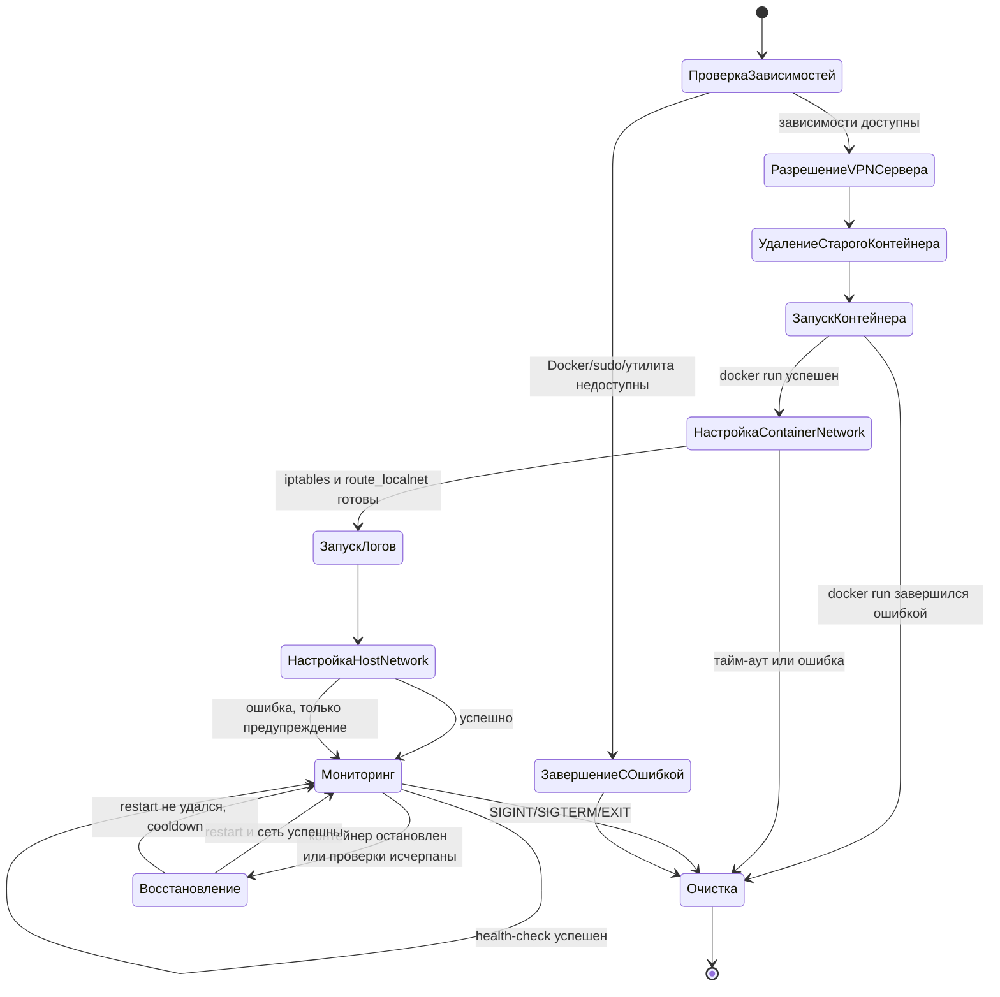
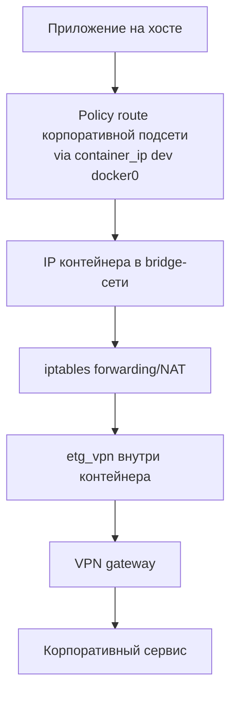
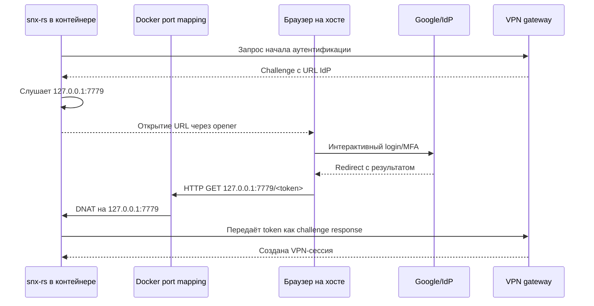
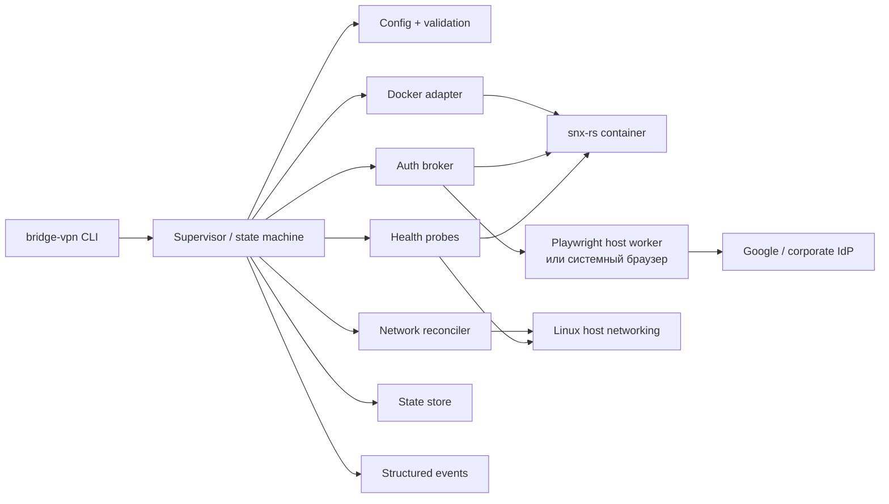
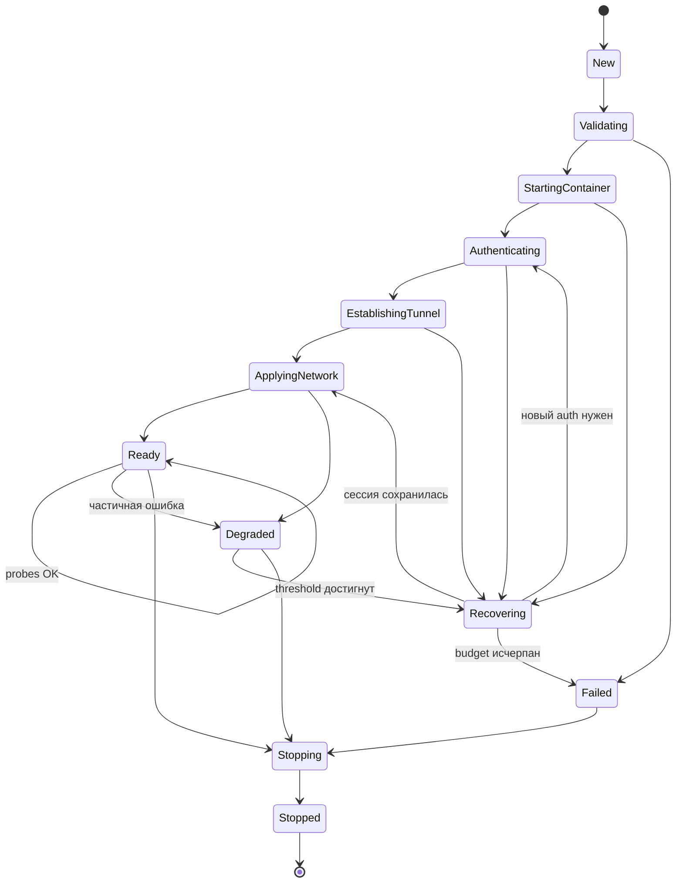
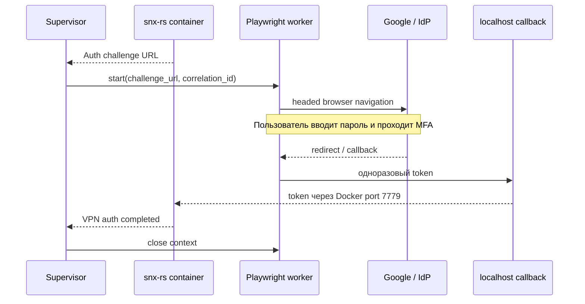

# Архитектура `run_bridge_vpn.sh`

Документ описывает фактическую архитектуру текущего скрипта и направление рефакторинга. Скрипт запускается на Linux-хосте и поднимает `snx-rs` внутри Docker-контейнера, после чего подключает маршруты и split DNS к хостовой системе.

> Статус: описание текущего состояния и предварительный план улучшений. Это не описание уже реализованной целевой архитектуры.

## 1. Назначение

`run_bridge_vpn.sh` является оркестратором VPN-моста между:

- Linux-хостом пользователя;
- Docker bridge-сетью;
- контейнером `snx-rs`, который устанавливает IPsec-туннель;
- корпоративной сетью, доступной через интерфейс VPN;
- локальным браузером пользователя, который может участвовать в IdP/Google-аутентификации.

Текущая конфигурация по умолчанию рассчитана на:

- VPN-сервер `achird.emergingtravel.com`;
- интерфейс туннеля `etg_vpn`;
- тип входа `vpn_etg_google_ravpn`;
- контейнер `snx-rs-vpn`;
- split DNS через `systemd-resolved`;
- проверку доступности `https://llmgate.etg.team`.

Скрипт работает в непрерывном режиме: после запуска он не завершается, а периодически проверяет доступность VPN и при определённых условиях перезапускает контейнер.

## 2. Текущая схема компонентов

### Ответственность компонентов

| Компонент | Ответственность |
| --- | --- |
| `run_bridge_vpn.sh` | Проверка зависимостей, запуск контейнера, настройка NAT, маршрутов и DNS, мониторинг и очистка |
| Docker Engine | Жизненный цикл контейнера и подключение к bridge-сети |
| Контейнер | Запуск `snx-rs`, наличие `/dev/net/tun`, IP forwarding и iptables |
| `snx-rs` | Аутентификация на Check Point и поддержание IPsec-туннеля |
| Docker bridge | Доставка трафика от хоста к IP контейнера |
| Linux policy routing на хосте | Направление трафика Check Point: адрес шлюза через физический uplink, корпоративные подсети в IP контейнера |
| `systemd-resolved` | Отправка DNS-запросов для корпоративных доменов на корпоративные DNS-серверы |
| Браузер | Интерактивная IdP-аутентификация и возврат одноразового значения на локальный порт |
| `curl` | Косвенная проверка доступности VPN через прикладной endpoint |

## 3. Запуск и жизненный цикл

### Последовательность запуска

1. Проверяются `docker`, `resolvectl`, `awk`, `getent`, `ip`, `curl`, `sudo`, `grep`, доступ к Docker daemon и запрет запуска самим `root`.
2. Для `SERVER_NAME` выполняется DNS-разрешение. Если оно не удалось, используется зашитый резервный адрес `87.228.66.146`.
3. Из Docker-конфигурации определяется физическое имя bridge-интерфейса, обычно `docker0`.
4. Очищаются ресурсы предыдущего запуска, если они остались, и удаляется контейнер с именем `CONTAINER_NAME`.
5. До запуска контейнера для адреса Check Point создаётся policy route через физический uplink, чтобы первый IKE-пакет не попал в AmneziaVPN. В ту же таблицу добавляется маршрут и правило для Docker bridge subnet, чтобы ответы первого HTTPS-запроса вернулись в контейнер.
6. Запускается новый контейнер из `ghcr.io/leleobhz/snx-rs-docker:latest`.
7. Скрипт ждёт появления iptables внутри контейнера и включает `route_localnet`.
8. В контейнере создаётся DNAT для порта `7779` на `127.0.0.1:7779`.
9. После появления интерфейса `IF_NAME` включается forwarding и MASQUERADE.
10. Таблица маршрутизации `18000` внутри контейнера читается через `docker exec`. Для хоста создаётся отдельная таблица policy routing `18001`: Docker bridge subnet и адрес Check Point закрепляются за физическим uplink/bridge, а найденные корпоративные подсети направляются через IP контейнера.
11. Для локальных подключённых сетей, Docker bridge subnet, Check Point и корпоративных направлений добавляются правила с приоритетом `50`, поэтому policy routing Amnezia не перехватывает ни ответы SSH-клиентам в локальной сети, ни первый ответ gateway, ни обратный трафик контейнера, ни Check Point-трафик. Дополнительные сети для доступа к хосту задаются через `HOST_ACCESS_NETWORKS`. На bridge-интерфейсе хоста настраиваются корпоративные DNS и routing domains через `resolvectl`.
12. Запускается фоновая трансляция `docker logs -f`.
13. Скрипт переходит в бесконечный цикл health-check.

## 4. Сетевой поток

На стороне контейнера выполняются две основные сетевые операции:

- `PREROUTING -p tcp --dport 7779 -j DNAT --to-destination 127.0.0.1:7779` — проброс локального callback-порта для IdP-аутентификации;
- `POSTROUTING -o "$IF_NAME" -j MASQUERADE` — NAT трафика, который из контейнера выходит через VPN-интерфейс.

На стороне хоста скрипт не добавляет default route. Он добавляет только подсети, объявленные `snx-rs` в таблице `18000`, а также исключения для локальных и явно настроенных сетей доступа к хосту. Поэтому обычный интернет-трафик должен оставаться вне Check Point VPN; full-tunnel AmneziaWG по-прежнему используется для остальных направлений.

## 5. Аутентификация и порт `7779`

Для `MfaType::IdentityProvider` текущий `snx-rs` создаёт listener на `127.0.0.1:7779`, открывает URL IdP через `opener` и ждёт HTTP-запрос браузера. Значение из path запроса рассматривается как OTP/результат аутентификации.

В Docker-сценарии это требует специального моста:

### Важное ограничение текущей реализации

`run_bridge_vpn.sh` сам не извлекает URL IdP и не запускает браузер на хосте. Это проблемно, потому что `snx-rs` находится в контейнере, а `opener::open` внутри контейнера не обязан иметь доступ к графической сессии хоста.

Проброс порта `7779` решает только доставку callback-запроса. Он не решает задачу запуска браузера и передачи ему challenge URL. Поэтому успешность Google login сейчас зависит от особенностей Docker-образа, окружения и ручных действий пользователя.

## 6. Переменные конфигурации

Все параметры задаются через переменные окружения. Валидации формата значений почти нет.

| Переменная | По умолчанию | Назначение |
| --- | --- | --- |
| `SERVER_NAME` | `achird.emergingtravel.com` | Имя VPN-сервера |
| `IF_NAME` | `etg_vpn` | Имя VPN-интерфейса внутри контейнера |
| `LOGIN_TYPE` | `vpn_etg_google_ravpn` | Идентификатор метода входа Check Point |
| `LOG_FILE` | `snx_bridge_vpn.log` | Файл лога оркестратора и запуска контейнера |
| `CONTAINER_NAME` | `snx-rs-vpn` | Имя Docker-контейнера |
| `TIMEOUT_DOCKER_BOOT` | `10` | Тайм-аут ожидания сетевой подсистемы контейнера |
| `HEALTHCHECK_URL` | `https://llmgate.etg.team` | URL прикладной проверки |
| `HEALTHCHECK_INTERVAL` | `20` | Пауза между проверками в секундах |
| `HEALTHCHECK_TIMEOUT` | `8` | Тайм-аут одного запроса |
| `HEALTHCHECK_FAILURE_THRESHOLD` | `3` | Число последовательных ошибок до восстановления |
| `HEALTHCHECK_WAKE_ATTEMPTS` | `2` | Дополнительные попытки перед restart |
| `HEALTHCHECK_WAKE_DELAY` | `2` | Пауза между дополнительными попытками |
| `RECONNECT_COOLDOWN` | `30` | Пауза после неудачного restart |
| `DISABLE_IPSEC_KEEPALIVE` | `false` | Значение `--no-keepalive` для `snx-rs` |
| `ROUTES_TMP_FILE` | `/tmp/snx_added_routes.txt` | Список маршрутов для совместимости с очисткой старого запуска |
| `HOST_ROUTE_TABLE` | `18001` | Отдельная таблица policy routing для Check Point и сетей доступа к хосту |
| `HOST_ROUTE_RULE_PRIORITY` | `50` | Приоритет правил Check Point и host-access; ниже правил Amnezia |
| `HOST_ACCESS_NETWORKS` | пусто | Дополнительные IPv4-сети, из которых нужен доступ к хосту, через пробел или запятую; локальные подключённые сети добавляются автоматически |
| `AMNEZIA_CONFIG_FILE` | `~/.config/AmneziaVPN.ORG/AmneziaVPN.conf` | Конфигурация, из которой извлекаются IPv4 endpoints Amnezia |
| `AMNEZIA_ENDPOINTS` | пусто | Явный список IPv4 endpoints Amnezia через пробел или запятую |

В самом `docker run` также зафиксированы параметры:

- образ с тегом `latest`;
- `--privileged`;
- `/dev/net/tun`;
- `NET_ADMIN` и `SYS_ADMIN`;
- публикация `7779:7779`;
- volume `/opt/snx/sessions:/var/cache/snx-rs/sessions`;
- read-only bind `/lib/modules`;
- IPsec, persistent IKE session и split-route режим;
- `--log-level debug`.

## 7. Мониторинг и автоматическое восстановление

Проверка состоит из следующих веток:

1. Если контейнер не запущен, вызывается `docker restart`.
2. Если `curl` успешен, счётчик ошибок сбрасывается.
3. После `HEALTHCHECK_FAILURE_THRESHOLD` ошибок выполняются дополнительные запросы.
4. Если дополнительные запросы не помогли, контейнер перезапускается.
5. После перезапуска повторяются настройки container network и host network.
6. При неудаче скрипт ждёт `RECONNECT_COOLDOWN` и продолжает цикл.

Сейчас health-check использует только exit code `curl`. Так как не используется `--fail`, HTTP-ответы 4xx и 5xx могут считаться успешными. Кроме того, один внешний URL не доказывает отдельно, что:

- IPsec-сессия жива;
- VPN-интерфейс существует;
- все необходимые маршруты установлены;
- split DNS работает;
- именно корпоративный путь используется для запроса.

## 8. Очистка ресурсов

При `EXIT`, `SIGINT` или `SIGTERM` вызывается `cleanup`:

1. останавливается процесс `docker logs -f`;
2. выполняется `resolvectl revert` для bridge-интерфейса;
3. удаляются маршруты из `ROUTES_TMP_FILE`;
4. контейнер удаляется через `docker rm -f`.

Очистка является best effort: ошибки `sudo`, `ip`, `resolvectl` и Docker подавляются. Это удобно для завершения, но затрудняет диагностику частично очищенного состояния.

## 9. Известные проблемы текущей архитектуры

### Надёжность

- Нет `set -Eeuo pipefail`, поэтому часть ошибок может быть потеряна.
- Нет блокировки от двух одновременных запусков.
- При `SIGKILL`, падении хоста или отключении питания маршруты и DNS могут остаться.
- Файл маршрутов удаляется в начале нового запуска. После аварийного завершения новый процесс теряет сведения о старых маршрутах.
- Нет атомарного state-файла и проверки владельца маршрута.
- После ошибки первичной настройки мониторинг повторяет настройку policy routing при следующем health-check.
- Фиксированная задержка восстановления блокирует мониторинг и не учитывает число неудачных попыток.
- Нет отдельного readiness-критерия: контейнер «запущен» не означает, что VPN-аутентификация завершена.
- `docker restart` не гарантирует сохранение IP контейнера, поэтому все сетевые ресурсы должны каждый раз пересобираться как единый набор.

### Безопасность

- `--privileged` даёт контейнеру избыточные права.
- Образ с тегом `latest` изменяем и не обеспечивает воспроизводимость.
- Включён `debug`-лог, а логи контейнера не классифицируются по чувствительности.
- Нет ограничения размера и ротации `LOG_FILE`.
- Нет явного `sudo -v` в начале, поэтому запрос пароля может произойти в середине операции.
- Фиксированный локальный порт и широкая обработка callback-запросов требуют проверки источника, срока жизни и одноразовости token.
- Состояние IKE хранится в bind mount, но политика прав доступа к `/opt/snx/sessions` в скрипте не проверяется.

### Сопровождение

- В одном Bash-файле смешаны конфигурация, Docker API, сетевой control plane, DNS, auth bridge, мониторинг и cleanup.
- Часть команд использует текстовый парсинг вывода `docker`, `ip` и `awk`.
- Используется резервный IP, зашитый в коде, но нет проверки актуальности DNS и сертификата.
- Нет команды `status`, `doctor`, `logs`, `stop` и `reconnect`.
- Нет машинно-читаемого формата событий для внешнего supervisor или UI.
- Логи `docker logs -f` выводятся в терминал отдельно от основного файла.

## 10. Предлагаемая целевая архитектура

Рекомендуется оставить Docker и `snx-rs` изолированным VPN-движком, но вынести управление в отдельные компоненты. На первом этапе это можно сделать даже в Bash с чёткими границами, а затем перенести state machine в Rust или Go.

### Логические модули

| Модуль | Граница ответственности |
| --- | --- |
| `Config` | Значения по умолчанию, типизация, диапазоны, обязательные параметры, безопасные ошибки |
| `Supervisor` | Состояния, тайм-ауты, retry/backoff, отмена, взаимное исключение запусков |
| `DockerAdapter` | Создание, inspect, logs, restart, stop, image digest, readiness контейнера |
| `NetworkReconciler` | Идемпотентное применение и удаление маршрутов, NAT и split DNS |
| `AuthBroker` | Передача challenge URL браузеру и возврат результата в `snx-rs` |
| `HealthProbes` | Проверка контейнера, туннеля, маршрутов, DNS и прикладной доступности |
| `StateStore` | Текущая версия конфигурации, container ID, IP, маршруты, generation и last error |
| `Events` | JSON-события для логов, systemd и будущего UI |

### Явная модель состояний

Ключевое отличие от текущего скрипта: состояние должно описывать не только процесс Docker, но и готовность туннеля. Перезапуск следует выполнять после проверки конкретного неисправного слоя, а не только после одного неудачного HTTP-запроса.

## 11. План рефакторинга

### Этап 1. Без изменения механизма запуска

- Добавить `set -Eeuo pipefail` и единый `error` trap.
- Проверять числовые переменные и допустимые значения boolean.
- Добавить lock-файл или `flock`.
- Выполнить `sudo -v` перед изменением сети.
- Вынести образ, volume, capabilities, DNS и маршруты в конфигурацию.
- Заменить `latest` на digest или версионированный тег.
- Добавить `--fail-with-body` для health-check и проверку ожидаемого HTTP-кода.
- Разделить `probe_container`, `probe_tunnel`, `probe_routes`, `probe_dns` и `probe_application`.
- Сделать применение сети идемпотентным и повторяемым.
- Хранить состояние и список ресурсов в отдельном каталоге, а не только в `/tmp`.

### Этап 2. Безопасный lifecycle

- Ввести команды `start`, `stop`, `status`, `doctor`, `logs`, `reconnect`.
- Использовать exponential backoff с верхним пределом и jitter.
- Ввести budget восстановления: например, не более N перезапусков за интервал.
- Не удалять чужой контейнер с тем же именем без проверки label владельца.
- Добавить labels контейнера: имя приложения, профиль, generation, версия образа.
- Удалять только маршруты и DNS-настройки, созданные данным generation.
- Разделить «не удалось подключиться», «туннель деградировал» и «невозможно проверить».
- Добавить корректное завершение по сигналу и повторную очистку после аварийного старта.

### Этап 3. Наблюдаемость

- Писать структурированные JSON-события с `event`, `state`, `generation`, `attempt` и длительностью.
- Не писать в лог URL с секретными query-параметрами, OTP, cookies и содержимое challenge.
- Добавить ротацию логов.
- Сохранять диагностический snapshot: container ID, IP, состояние интерфейса, маршруты и DNS без секретов.
- Показывать причину последнего перехода в `Degraded` или `Recovering`.

### Этап 4. Вынос оркестратора из Bash

Когда state machine и auth broker потребуют сложного взаимодействия, целесообразно заменить основной скрипт небольшим сервисом на Rust или Go. Bash можно оставить тонким launcher-ом.

Варианты:

1. **Rust supervisor** — лучше интегрируется с `snx-rs`, типами конфигурации и существующим IPC.
2. **Go supervisor** — удобен для daemon/service и Docker API, но добавляет второй основной язык.
3. **Python/Node supervisor** — быстро реализуется вместе с Playwright, но слабее подходит для privileged network lifecycle и долгоживущего системного сервиса.

Практичный компромисс: supervisor на Rust, а Playwright — отдельный unprivileged Node.js worker с узким callback API.

## 12. Интеграция Playwright для Google login

### Рекомендованный вариант

Использовать Playwright как **интерактивный auth worker**, а не как средство автоматического ввода Google-пароля.

Worker должен:

1. получить от supervisor challenge URL;
2. открыть headed Chromium в пользовательской сессии;
3. позволить пользователю пройти Google login, MFA, CAPTCHA и выбор аккаунта вручную;
4. дождаться redirect на локальный callback;
5. передать только одноразовый результат supervisor;
6. закрыть browser context и удалить временное состояние.

### Почему не следует автоматизировать пароль Google

- Google активно обнаруживает автоматизированные браузеры и может потребовать CAPTCHA или дополнительную проверку.
- Хранение Google-пароля в environment, файле или CI-секрете создаёт серьёзный риск.
- MFA, security keys и device trust не должны обходиться автоматизацией.
- Автоматизация входа может нарушать политики Google и корпоративного IdP.
- Селекторы страниц Google нестабильны и не являются надёжным API.

Playwright допустим для управления браузером после явного действия пользователя. Для unattended-сценария лучше использовать официальный OIDC/SAML device flow, service account, workload identity или иной поддерживаемый корпоративный механизм, если Check Point/IdP его предоставляет.

### Где запускать Playwright

Playwright не следует помещать в текущий privileged VPN-контейнер:

- контейнеру потребуются браузерные зависимости и доступ к display/Wayland/X11;
- privileged-контейнер сочетает сетевые права VPN с поверхностью атаки браузера;
- `opener` внутри контейнера не гарантирует запуск приложения на desktop хоста.

Предпочтительно запускать worker на хосте от обычного пользователя. Связь с supervisor должна быть ограничена localhost Unix socket или loopback HTTP с:

- одноразовым `correlation_id`;
- TTL challenge;
- проверкой ожидаемого callback host и scheme;
- запретом логирования URL и token;
- одним активным login flow на профиль.

### Как связать Playwright с текущим `snx-rs`

В текущем коде `snx-rs` сам вызывает `BrowserController::open`, поэтому надёжная интеграция через один только Bash невозможна. Потребуется один из вариантов:

1. **Минимальный адаптер образа**: выводить auth challenge отдельным структурированным событием, а host worker запускать по этому событию.
2. **Параметр browser callback**: передавать `snx-rs` URL или команду, через которую он просит внешний worker открыть challenge.
3. **Новый auth broker в `snx-rs`**: выделить интерфейс browser controller и реализовать IPC-клиент к host worker.
4. **Полностью ручной fallback**: если worker недоступен, вывести URL пользователю и оставить текущий системный браузер.

Не следует надёжно парсить обычные строки `docker logs`: формат логов не является API. Лучше добавить JSON-событие вида `auth.challenge` без публикации секретного содержимого.

## 13. Безопасность целевой версии

Минимальные требования:

- pin образа по digest;
- минимально необходимые capabilities вместо `--privileged`, если это совместимо с IPsec/TUN;
- read-only root filesystem, где возможно;
- отдельный unprivileged browser worker;
- запрет попадания password, OTP, cookies и IdP URL с token в логи;
- права `0700` на state directory и session volume;
- одноразовые callback token с TTL и correlation id;
- проверка, что callback приходит от локального процесса и относится к активному login flow;
- явное подтверждение изменения маршрутов и DNS в диагностике;
- корректное удаление state при logout и остановке;
- отсутствие shell-команд с пользовательскими строками без безопасного quoting и валидации.

## 14. Критерии готовности рефакторинга

Рефакторинг можно считать полезным, если выполняются следующие условия:

- повторный запуск не ломает уже настроенную сеть и не удаляет чужие ресурсы;
- после `SIGKILL` следующий запуск обнаруживает и исправляет оставшееся состояние;
- временная потеря health endpoint не приводит сразу к перезапуску VPN;
- VPN считается `Ready` только после проверки туннеля, маршрутов, DNS и прикладного трафика;
- восстановление имеет ограниченный retry budget и backoff;
- доступны `status`, `doctor` и диагностический snapshot;
- образ воспроизводим и зафиксирован по версии/digest;
- Google login работает в headed Playwright через ручное подтверждение пользователя;
- при недоступности Playwright сохраняется ручной fallback;
- тесты проверяют ошибки Docker, DNS, iptables, `resolvectl`, смену IP контейнера и повторный login;
- в логах отсутствуют секреты.

## 15. Приоритет ближайших изменений

1. Добавить lock, строгий режим Bash, валидацию конфигурации и `sudo -v`.
2. Исправить health-check: HTTP-код, отдельные probes и readiness.
3. Перейти с временного списка маршрутов на управляемый state directory и labels.
4. Зафиксировать Docker-образ и ограничить права контейнера.
5. Ввести структурированное auth-событие между `snx-rs` и хостом.
6. Реализовать host-side Playwright worker с ручным Google login и ручным fallback.
7. После стабилизации протоколов перенести supervisor из Bash в Rust или Go.
